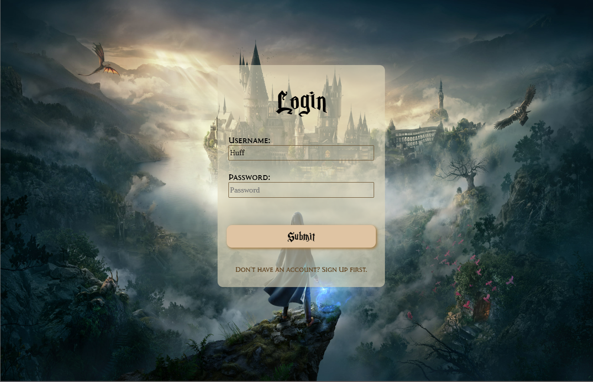

# Wizardly Whispers

This project is a real-time chat application based on the group discussions that take place in different houses of Hogwarts School of Witchcraft and Wizardry from the Harry Potter series. The application allows users to login or signup if they are new and then join the conversation of the house they are allocated.

## Features

- **User Authentication:** Users can create an account or login if they already have one.
- **Password Validtion:** Strong password requirements are enforced to ensure account security, including minimum length, combination of letters, numbers, and special characters.
- **User Validation:** Input validation is implemented to ensure that user information is properly entered.
- **Real-time Chat:** Users can participate in real-time group discussions with other members of their allocated house.
- **House-specific Conversations:** Each house has its own chatroom, where only members of that house can participate.
- **Message History:** Users can view previous messages in the chatroom.
- **Usernames:** Users can see the name of other members who are in the same house as them.
- **Responsive Design:** The website is fully responsive and adapts to different screen sizes and devices.



## Installation

  To run the Wizardly Whispers locally, follow these steps:

  1. Clone the repository:
 
     ```shell
     git clone https://github.com/riteshar7/Wizardly_Whispers.git

  2. Navigate to the project directory:

     ```shell
     cd Wizardly_Whispers
     cd nodeServer
     
  3. Install the dependencies
 
     ```shell
     npm install

  4. Start the application:
     
     ```shell
     node index
     
  5. Access the application in your browser at **'http://localhost:8000'**.

  .png)
 
## Technologies Used

- **Front-end:** HTML, CSS, JavaScript
- **Back-end:** Node.js, Express.js
- **Real-time communication:** Socket.io
- **Database:** MongoDB

## Authors

- [Ritesh Ranjan](https://github.com/riteshar7) - GitHub Profile
- [Prachi Sinha](https://github.com/PrachiSinha203) - GitHub Profile
